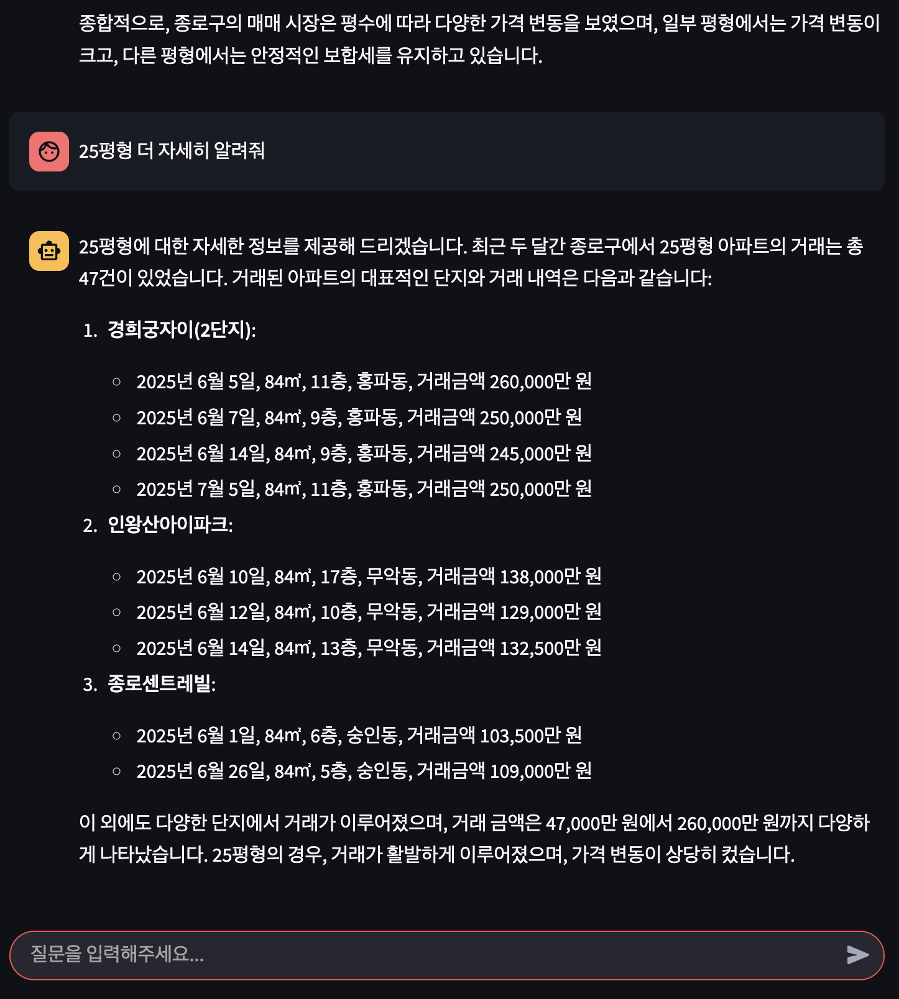

# 부동산 실거래 데이터 QA AI 에이전트 (Real Estate QA AI Agent)

사용자의 자연어 질문에 담긴 의도를 파악하고, 공공 데이터 및 지도 API를 활용하여 부동산 관련 정보를 분석하여 생성형 AI를 통해 답변하는 프로젝트

<p float="left">
  
  
</p>


## 주요 특징

- **의도 파악 및 정보 분석**: 자연어 질의에 대해 NLU(Latural Language Understanding), 구조화 진행 -> 그에 맞는 데이터를 동적으로 조회
- **생성형 AI 기반 답변**: 분석된 데이터를 기반으로 OpenAI의 LLM(거대 언어 모델)을 사용하여 사람과 대화하듯 자연스러운 답변을 생성
- **공공 데이터 활용**: 국토교통부의 실거래가 데이터, 행정안전부의 법정동 코드 데이터 등 공공 데이터를 기반

---

## 기술 스택 및 환경

- **Core**: Python, OpenAI API
- **Data Handling**: Pandas
- **APIs**: 국토교통부 실거래가 API (data.go.kr), Kakao Maps API
- **Environment**: Docker, Docker Compose, JupyterLab

---

## 프로젝트 진행 단계

| Status | Progress |
| :--: | :-- |
| [v] | **1. 핵심 기능 개발** |
| [v] | 1-1. [LLM] 자연어 질의 -> NLU + 구조화 |
| [v] | 1-2. [System] 시도, 시군구, 동 정보 보충 |
| [v] | 1-3. [System] NLU + 구조화 쿼리 기반 실거래 데이터 콜 |
| [v] | 1-4. [System] 최종 응답 생성 전 실거래 데이터 후처리 |
| [v] | 1-5. [LLM] 질의 의도별 응답 생성 |
| [v] | **2. Web Page 개발** |
| [v] | 2-1. Session / State 관리 -> streamlit 자체 기능 |
| [v] | **3. Backend 개발** |
| [v] | 3-1. AI Agent 기능 구현
| [v] | **4. AI Agent 티키타카(대화) 기능 개발** |
| [v] | 4-1. 대화 기록(History) 관리 및 컨텍스트 유지 |
| [v] | 4-2. 후속 질문(Follow-up Question) 이해 및 처리 (e.g., "그럼 거긴 어때?") |
| [ ] | 4-3. 불완전한 질의에 대한 되묻기(Clarification) 기능 (e.g., "매매를 찾으시나요, 전세를 찾으시나요?") |
| [ ] | 4-4. 이전 답변 참조 및 비교/요약 기능 |


| Component | NLU | query → structure | bjd code | real estate postprocess | llm input data prepare | gen new query final answer | gen cached query answer | caching |
| :--- | :--- | :--- | :--- | :--- | :--- | :--- | :--- | :--- |
| **Baseline** | ChatGPT | ChatGPT | system | system | system | ChatGPT | ChatGPT | python dictionary |
| **Adevanced(예정)** |  |  |  |  |  |  |  |  |
| **Optimized(예정)** |  |  |  |  |  |  |  |  |
| | | | | | | | | |

### To-do list

| Status | Task | Exam |
| :--: | :-- | :-- |
| [] | 신도시 이름 검색 대응 | "광교 최근 한달 아파트 매매 추이" |
| [] | 랜드마크 이름 검색 대응 | "롯데타워 근처 아파트 최근 전세 가격" |
| [] | sLLM Knowledge Distillation | OpenAI API -> Local Model |


---

## 프로젝트 구조

- **`/data`**: 법정동 코드 등
- **`/docs`**: 프로젝트 기획, 아키텍처 등 상세 문서를 관리
- **`/prompts`**: LLM에 전달할 프롬프트를 체계적으로 관리
- **`/src`**: API 호출, 데이터 처리, AI 로직 등 핵심 소스 코드를 모듈화하여 관리
- **`/workspace`**: 실제 분석 및 테스트를 수행하는 Jupyter 노트북(`.ipynb`)을 저장하는 메인 작업 공간
- **`Dockerfile` & `docker-compose.yml`**: Docker 개발 환경을 정의하고 실행
- **`.env.example`**: 필요한 환경 변수(API 키)의 목록을 안내하는 템플릿 파일

---

## 시작하기

### 사전 요구사항

- [Docker](https://www.docker.com/get-started) 및 [Docker Compose](https://docs.docker.com/compose/install/) 설치

### 실행 순서

1.  **Git 저장소 복제 (Clone)**
    ```bash
    git clone https://github.com/thekim9304/real-estate-ai-agent.git
    cd real-estate-ai-agent
    ```

2.  **환경 변수 설정 (API 키 입력)**
    `.env.example` 파일을 복사하여 `.env` 파일을 생성
    ```bash
    cp .env.example .env
    ```
    생성된 `.env` 파일을 열어 각 항목에 자신의 API 키를 입력

3.  **Docker 컨테이너 실행**
    아래 명령어를 실행하여 Docker 이미지를 빌드하고 컨테이너를 실행
    ```bash
    docker-compose up --build -d
    ```

4.  **서비스 접속**
    웹 브라우저에서 아래 주소로 접속하여 각 서비스 확인
    - 메인 웹 페이지 (Streamlit): http://localhost:8501
    - API 문서 (FastAPI): http://localhost:8000/docs
    - 개발 환경 (JupyterLab): http://localhost:8888

### 종료하기

프로젝트를 종료하려면 아래 명령어 입력
```bash
docker-compose down
```